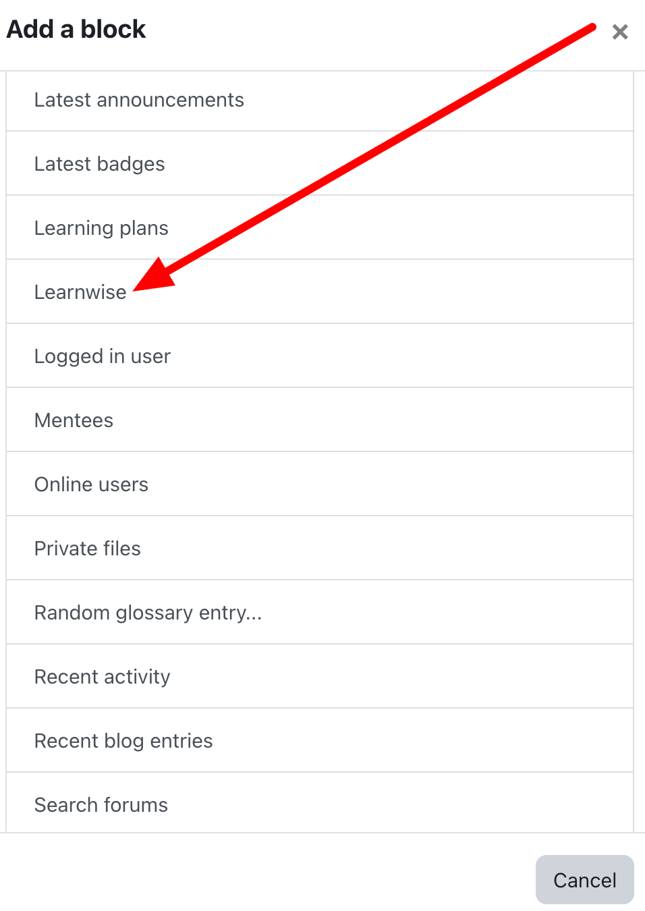

# Moodle LearnWise Block Plugin

This plugin allows you to publish assistants as a block.

## Requirements
- Moodle 3.4 or Higher
- PHP 7.2 or Higher
- [learnwise plugin](https://marketplace.moodle.com/plugins/local_learnwise)

## Installation steps
1. Download the plugin from from [GitHub](https://github.com/LearnWiseAI/moodle-block_learnwise) repository.
2. Go to Site Administrator > Plugins > Install plugins and upload the downloaded plugin zip file

## Adding a Block to the Course
1. Navigate to the course page where you want to add the block.
2. Click Turn editing on.
3. Click Add a block.
4. From the list that appears, select Learnwise.
   
